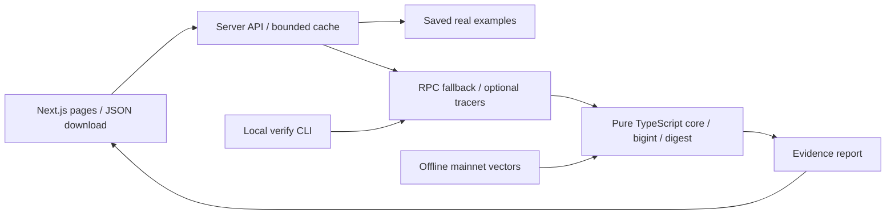

# ArcMirror

**One USDC movement. Every trace accounted for.**

Explorers show you what happened. ArcMirror shows you why the numbers add up, and lets you re-run the proof yourself.

ArcMirror explains Arc mainnet USDC movements, exact gas costs and their source evidence. Native USDC uses 18 decimals; the ERC-20 interface uses 6. Adding both log streams can count a movement twice. Paste a transaction hash or open a saved real example. No wallet, signature or payment is required to use the analyzer.

**Status:** deployed on Arc mainnet as a read-only analyzer. Owner-signed Lab scenarios remain pending. This is an onchain evidence analysis tool, not an audit service, custody service or refund guarantee.

- [Repository](https://github.com/aquattdabackup/ArcMirror)
- [Live website](https://arcmirror-six.vercel.app) (production); local address: http://localhost:3000
- Lab contract: tested locally, not deployed; no mainnet deployment address exists.
- [Validation](docs/validation.md), [spike findings](docs/spike-findings.md), [existing tools and overlap](docs/landscape.md)

## Try the software

Use Node.js 22 or newer (tested with Node 24). On Windows, use `npm.cmd` if PowerShell blocks `npm.ps1`.

```sh
npm ci
npm run dev
```

Production locally:

```sh
npm run build
npm start
```

Public RPC defaults are already configured. Optional server-only variables are documented in [.env.example](.env.example). For Next.js, put local values in `apps/web/.env.local`; for the CLI, set them in your terminal environment. Never use `NEXT_PUBLIC_` for RPC credentials. Never commit real `.env` files.

```sh
npm test
npm run test:spike
npm run typecheck
npm run build
cd contracts
forge test -vv
```

## Explore real examples

These are **existing public third-party transactions**, captured on September 24, 2026. They were not created by ArcMirror or its owner and do not satisfy the five owner-created demo scenarios. Saved snapshots remain available when RPC providers are unavailable; use **Re-verify live** to fetch again.

| Question | Actual result | Mainnet evidence |
| --- | --- | --- |
| Why do two log streams overstate a transfer? | 2 native movements totaling 4.499999 USDC; naive sum 8.999998. Logs/state agree, call-value coverage incomplete: **needs_review**. | [Blockscout](https://explorer.arc.io/tx/0x376b287a795c449b0bf3f0ec3ffdfad8e913012edecf0a8eb6f00c007a47b24f) / [ArcScan](https://arc.etherscan.io/tx/0x376b287a795c449b0bf3f0ec3ffdfad8e913012edecf0a8eb6f00c007a47b24f) |
| Where does gas go? | Recipient +0.01 USDC; sender -0.01042; block producer +0.00042. Three supported views reconcile: **verified**. | [Blockscout](https://explorer.arc.io/tx/0xa0311ec4a00a190a55d2b32bbf03eb03e656d64c9bdaa306fdc1d9061ae6ad87) / [ArcScan](https://arc.etherscan.io/tx/0xa0311ec4a00a190a55d2b32bbf03eb03e656d64c9bdaa306fdc1d9061ae6ad87) |
| What happens below six decimal places? | 1 native raw unit = 0.000000000000000001 USDC. No matching ERC-20 interface log. | [Blockscout](https://explorer.arc.io/tx/0x37567ff71a01f4966f0c4d5c4155dde45a293fd4450a57ce3c69d96c9777b3de) / [ArcScan](https://arc.etherscan.io/tx/0x37567ff71a01f4966f0c4d5c4155dde45a293fd4450a57ce3c69d96c9777b3de) |

In the web app, open `/tx/<hash>`, click a movement amount for source logs, toggle the double-count comparison, then download JSON. Gas is a separate row. The movement total counts every hop once and is not net wallet income.

## How the numbers are calculated

1. Require chain ID **5042**, a 32-byte hash and matching transaction/receipt/block/log identifiers. Success requires receipt status `0x1`.
2. Only Transfer logs emitted by `0xfffffffffffffffffffffffffffffffffffffffe` create canonical 18-decimal movements. Other tokens remain visible as raw logs but do not enter USDC totals.
3. Pair each 6-decimal USDC interface log from `0x3600000000000000000000000000000000000000` to one unmatched canonical movement with identical sender, recipient and `value18 = value6 * 10^12`. Prefer the closest log index, with lower index breaking ties. Repeated identical movements remain distinct. Unmatched interface logs generate warnings; there is no blanket divide-by-two rule.
4. Compute gas separately as `gasUsed * effectiveGasPrice`. All amounts use bigint internally and decimal strings in JSON. Sub-micro-USDC dust is never silently rounded to zero.
5. Where available, compare successful native call edges and transaction-local `prestateTracer` balance deltas. Reverted ancestors suppress their child movements. The balance identity includes the receipt fee charged to the transaction sender and credited to the observed block producer.
6. Hash canonical sorted-key JSON (excluding its own digest) with keccak256. Capture time/provider credentials are outside the report digest.

| Evidence level | Meaning |
| --- | --- |
| `verified` | Canonical logs, supported native call values and transaction-local state changes reconcile. |
| `consistent` | Log evidence is internally consistent; one or both additional views are unavailable. |
| `needs_review` | Evidence is incomplete, unsupported or disagrees. Reasons and unexplained balance residuals remain visible. |

**Important Arc finding:** USDC precompile transfers can change balances while native call values remain zero. The composed ERC-20 example must not be labeled three-way verified. These are three data representations, not necessarily three independent providers or a cryptographic consensus proof. A digest proves report equality, not RPC honesty.

## Re-run a report

Download a report as `report.json`, then:

```sh
npm run verify -- 0xa0311ec4a00a190a55d2b32bbf03eb03e656d64c9bdaa306fdc1d9061ae6ad87 --report report.json
```

Use `--out fresh.json` to save a fresh report, `--logs-only` if your provider lacks tracers, or `--fixture vectors/<hash>.json` for deterministic offline verification. A change in available evidence or algorithm version can change the digest. The CLI checks the supplied digest and prints differing top-level fields. It exits nonzero for mismatches or incomplete transaction status.

[Standalone core usage](packages/core/README.md) and [vector provenance](vectors/README.md). No npm publication has been performed.

## Architecture



- `apps/web`: `/`, `/tx/[hash]`, `/how-it-works`; `/api/health`, `/api/examples`, `/api/analyze/<hash>`.
- `packages/core`: pure analyzer with compiled ESM/declarations, independent of UI and network.
- `packages/rpc`: server/CLI RPC adapter, chain checks, fallback, timeout and bounded responses.
- `contracts`: immutable-recipient ArcMirrorLab and Foundry tests; owner-signed deployment pending.
- `vectors`, `docs/evidence/spike`: captured public evidence, expected reports and provenance.

## Checks actually run

37 analyzer/vector/RPC tests, 10 spike evidence tests and 16 Foundry tests passed (including 256 fuzz runs). Type checking, standalone core packaging and the Next.js production build passed. Local desktop/mobile UI, APIs and live digest comparisons were checked. Production dependency audit and source secret scan returned no findings. Browser-generated JSON matched its fixture and live RPC; browser file saving remains unverified because the test browser canceled downloads. Details and outputs are in [validation](docs/validation.md).

## Limits and deployment status

- No memo decoding, invoice CSV reconciliation, Dune query, MCP endpoint or OG sharing card. Memo bytecode existence alone has not established identity or semantics.
- Historical fork/genesis coverage is not certified. Unusual trace types and precompile movements require review.
- RPC endpoints may throttle or lose tracer support. Cache and rate limits are in-process (not distributed): 256 reports / one-hour TTL, 8 concurrent analyses, 30 client and 120 global requests per minute per instance. Hosting-level limits are still needed for a larger deployment.
- Basic CSP/security headers are configured. Inline scripts/styles remain allowed for the Next.js bootstrap; nonce-based CSP is not implemented.
- Contract mock tests do not emulate Arc's native/ERC-20 shared balance or mainnet system logs. Mainnet validation, production smoke tests and at least five owner-created transactions remain required.
- Gitleaks and dependency checks are recorded in [validation](docs/validation.md); these are not an audit.
- [Deployment and owner setup](docs/deployment.md), [eligibility](docs/eligibility.md). The user performs the final grant submission.

## Continue with another coding agent

Read [AGENTS.md](AGENTS.md) and [the portable handoff](docs/HANDOFF.md). They preserve the owner's decisions, small-commit workflow, current blockers and next steps. [Project memory](task_on_progress.md) records local versus remote Git state; the [original brief](docs/product-brief.vi.md) is included for agents without access to this chat.

## License

License selection awaits the owner's confirmation. No MIT license has been applied. Packages are private and Solidity currently uses `UNLICENSED`; source visibility does not grant an open-source license.
